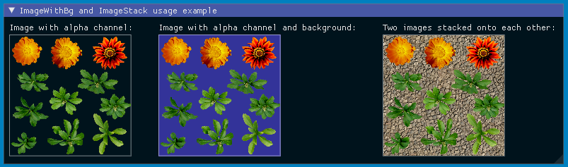

# Table of Contents

- [Usage of ImGui for User Interfaces](#usage-of-imgui-for-user-interfaces)
  - [imgui_manager and Establishing Callbacks](#imgui_manager-and-establishing-callbacks)
  - [Rendering Textures with get_or_create_texture_descriptor](#rendering-textures-with-get_or_create_texture_descriptor)
  - [Additional Image Utils](#additional-image-utils)

# Usage of ImGui for User Interfaces

_Auto-Vk-Toolkit_ offers support for usage of the graphical user interface library [Dear ImGui](https://github.com/ocornut/imgui). Its headers are not included by default.
They _can_ be used by applications by including its header:
```cpp
#include <imgui.h>
```
The example applications make use of it extensively. ImGui-specific usage description can be found under:

- Section [Usage] in its [README.md](https://github.com/ocornut/imgui).
- Detailed documentation can be found in the [Dear ImGui Wiki](https://github.com/ocornut/imgui/wiki).

## imgui_manager and Establishing Callbacks

There is one class in particular which serves as a bridge between _Auto-Vk-Toolkit_ and ImGui which is the `avk::invokee`-class `avk::imgui_manager`. 
An instance of `avk::imgui_manager` can be added to a composition. This also means that its callback methods are invoked constantly---in particular during the `update` and `render` stages.

The pattern to use `avk::imgui_manager` is mainly through its `add_callback` methods which allows user code to be executed.
It can be set-up during the `initialize` stage of a `avk::invokee` as follows:

```cpp
auto imguiManager = avk::current_composition()->element_by_type<avk::imgui_manager>();
if(nullptr != imguiManager) {
	imguiManager->add_callback([this](){	
		ImGui::Begin("Hello, world!");
		ImGui::SetWindowPos(ImVec2(10.0f, 10.0f), ImGuiCond_FirstUseEver);
		ImGui::Text("%.3f ms/frame", 1000.0f / ImGui::GetIO().Framerate);
    		ImGui::End();
  	});
}
```

This code first tries to get a pointer to an instance of `avk::imgui_manager` which is assumed to have been added to the composition and on success, a callback is added to the returned instance via `avk::imgui_manager::add_callback`. Inside the callback, ImGui code can be invoked as requested by the user application. All of ImGui's functionality should be accessible. 

## Rendering Textures with get_or_create_texture_descriptor

Rendering custom images and textures with ImGui can be achieved via `ImGui::Image` and is described in the Wiki article [Image Loading and Displaying Examples](https://github.com/ocornut/imgui/wiki/Image-Loading-and-Displaying-Examples). It describes that custom textures can be rendered via a generic [`ImTextureId`](https://github.com/ocornut/imgui/wiki/Image-Loading-and-Displaying-Examples#about-imtextureid) image handle. 

_Auto-Vk-Toolkit_ offers to get a suitable `ImTextureId` via `avk::imgui_manager::get_or_create_texture_descriptor`. It can be used as follows in conjunction with `ImGui::Image`:

```cpp
auto imguiManager = avk::current_composition()->element_by_type<avk::imgui_manager>();
if(nullptr != imguiManager) {
	imguiManager->add_callback([this, imguiManager](){	
		ImGui::Begin("ImTextureID usage example");
		ImTextureID imTexId = imguiManager->get_or_create_texture_descriptor(mMyImageSampler.as_reference(), avk::layout::general); // mMyImageSampler is of type avk::image_sampler 
		ImGui::Image(imTexId, ImVec2(512.f, 512.f));
		ImGui::End();
	});
}
```

## Additional Image Utils

_Auto-Vk-Toolkit_ extends [Dear ImGui](https://github.com/ocornut/imgui) with support for a background color on images with alpha channes via `ImGui::ImageWithBg` and rendering multiple images on top of each other via `ImGui::ImageStack`. The background color is specified as the last argument to `ImGui::ImageWithBg` and defaults to fully transparent. `ImGui::ImageStack` takes a `std::initializer_list<ImTextureID>` as the first argument and renders the images in the the specified order from back to front. `ImGui::ImageStack` also supports setting a background color as the last argument which defaults to fully transparent.

The added functions can be used by including [`imgui_utils.h`](../auto_vk_toolkit/include/imgui_utils.h) and usage is similar to `ImGui::Image` by first creating a suitable `ImTextureId` via `avk::imgui_manager::get_or_create_texture_descriptor`:

```cpp
#include "imgui_utils.h"

auto imguiManager = avk::current_composition()->element_by_type<avk::imgui_manager>();
if(nullptr != imguiManager) {
	imguiManager->add_callback([this, imguiManager](){	
		ImGui::Begin("ImTextureID usage example");
		ImTextureID imTexIdOpaque = imguiManager->get_or_create_texture_descriptor(myImageSamplerOpaque.as_reference(), avk::layout::shader_read_only_optimal); // mMyImageSamplerOpaque is of type avk::image_sampler 
		ImTextureID imTexIdTransparent = imguiManager->get_or_create_texture_descriptor(myImageSamplerTransparent.as_reference(), avk::layout::general); // mMyImageSamplerBack is of type avk::image_sampler 

		ImGui::Text("Image with alpha channel:");
		ImGui::ImageWithBg(imTexIdTransparent, ImVec2(512.f, 512.f), ImVec2(0,0), ImVec2(1,1), ImVec4(1.0f,1.0f,1.0f,1.0f), ImVec4(1.0f,1.0f,1.0f,0.5f), ImVec4(0.0f, 0.0f, 0.0f, 0.0f));

		ImGui::Text("Image with alpha channel and background:");
		ImGui::ImageWithBg(imTexIdTransparent, ImVec2(512.f, 512.f), ImVec2(0,0), ImVec2(1,1), ImVec4(1.0f,1.0f,1.0f,1.0f), ImVec4(1.0f,1.0f,1.0f,0.5f), ImVec4(0.2f, 0.2f, 0.6f, 1.0f));

		ImGui::Text("Two images stacked onto each other:");
		ImGui::ImageStack({ imTexIdOpaque, imTexIdTransparent }, ImVec2(512.f, 512.f), ImVec2(0, 0), ImVec2(1, 1), ImVec4(1.0f, 1.0f, 1.0f, 1.0f), ImVec4(1.0f, 1.0f, 1.0f, 0.5f), ImVec4(0.0f, 0.0f, 0.0f, 0.0f));

		ImGui::End();
	});
}
```
Example output of an image with alpha channel without background (left), the same image rendered with background (middle), and the same image rendered on top of another image (right):


