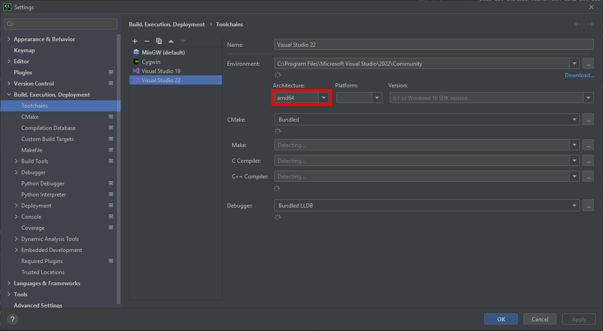
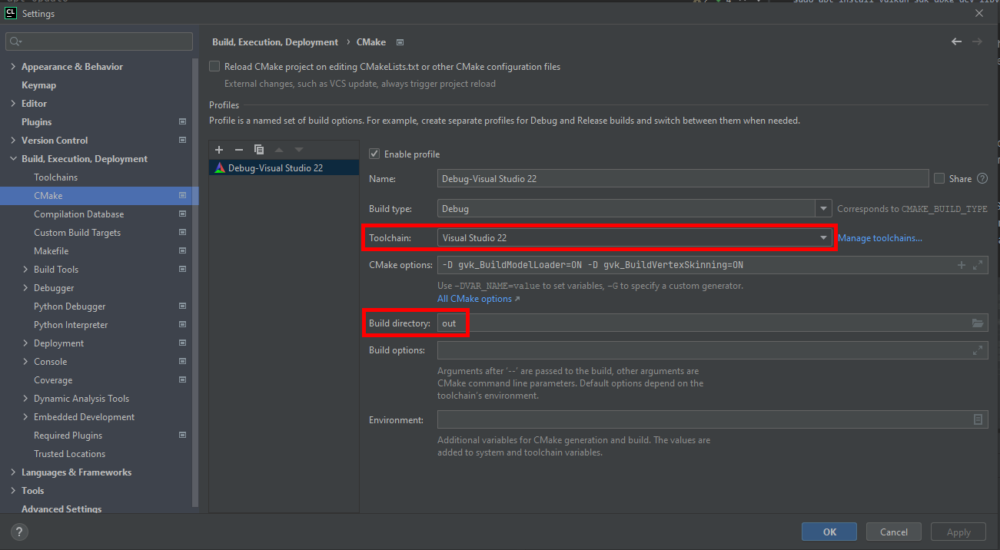

# CMake

_Gears-Vk_ also supports building with CMake on Linux (*GCC* or *Clang*) and Windows (*MSVC*).

There are currently no pre-built binaries of *Gears-Vk*'s dependencies for Linux included in the repository, so they are built alongside *Gears-Vk* the first time you build it.
However, if there is already an *ASSIMP* build installed on your system (so that it can be found via `find_package(assimp)`), it will be used instead (e.g., on Ubuntu 20.04 `sudo apt-get install libassimp-dev` can be executed to get *ASSIMP* version 5.0.1).
On Windows pre-built binaries of dependencies are included and used when building *Gears-Vk*.

## CLion

### Linux: Ubuntu

No special settings are required on Linux. CLion can use the bundled cmake. The following packages have to be installed on your system:
```
sudo add-apt-repository -y ppa:ubuntu-toolchain-r/test
sudo apt update && sudo apt install libassimp-dev g++-11 
sudo update-alternatives --install /usr/bin/gcc gcc /usr/bin/gcc-11 60 --slave /usr/bin/g++ g++ /usr/bin/g++-11
sudo add-apt-repository ppa:oibaf/graphics-drivers
sudo apt update && sudo apt upgrade -y
sudo apt install libvulkan-dev libvulkan1 mesa-vulkan-drivers vulkan-utils

# Verify that Vulkan has been installed correctly:
vulkaninfo

# Install additional Vulkan packages:
wget -qO - http://packages.lunarg.com/lunarg-signing-key-pub.asc | sudo apt-key add -
sudo wget -qO /etc/apt/sources.list.d/lunarg-vulkan-focal.list http://packages.lunarg.com/vulkan/lunarg-vulkan-focal.list
sudo apt update
sudo apt install vulkan-sdk dpkg-dev libvulkan1-dbgsym vulkan-tools-dbgsym
```
After following these steps, the examples should build and execute successfully.
These steps have been tested on Ubuntu 20. 

### Windows

Under the assumption that the Visual Studio, Vulkan SDK, CMake, and CLion are installed, the following settings have to be set in CLion:

The toolchain has to be adapted to Visual Studio and the default setting to x64, or the code of the framework will not compile.
Then, select the correct toolchain in the CMake settings menu.




The Build directory can optionally also be set to `out`, as this specific name is included in the `.gitignore`, any other default name from CLion is not.

The developer-mode in the current Windows account might be needed in order to get it to work (see caveats at the bottom of this readme).

### CMake Options
The build process can be configured, supporting the following options:

| Name | Description | Default |
| ---- | ----------- | ------- |
| `gvk_LibraryType` | The type of library gvk should be built as. Must be `INTERFACE`, `SHARED` or `STATIC` | `STATIC` |
| `gvk_ForceAssimpBuild` | Forces a local build of *ASSIMP* even if it is installed on the system. (Linux only) | `OFF` |
| `gvk_StaticDependencies` | Sets if dependencies (*ASSIMP* & *GLFW*) should be built as static instead of shared libraries. (Linux only) | `OFF` |
| `gvk_ReleaseDLLsOnly` | Sets if release DLLS (*ASSIMP* & *STB*) should be used for examples, even for debug builds. (Windows only) | `ON` |
| `gvk_CreateDependencySymlinks` | Sets if dependencies of examples, i.e. DLLs (Windows only) & assets, should be copied or if symbolic links should be created. | `ON` |
| `gvk_BuildExamples` | Build all examples for *Gears-Vk*. | `OFF` |
| `gvk_BuildHelloWorld` | Build example: hello_world. | `OFF` |
| `gvk_BuildFramebuffer` | Build example: framebuffer. | `OFF` |
| `gvk_BuildComputeImageProcessing` | Build example: compute_image_processing. | `OFF` |
| `gvk_BuildMultiInvokeeRendering` | Build example: multi_invokee_rendering. | `OFF` |
| `gvk_BuildModelLoader` | Build example: model_loader. | `OFF` |
| `gvk_BuildOrcaLoader` | Build example: orca_loader. | `OFF` |
| `gvk_BuildRayQueryInRayTracingShaders` | Build example: ray_query_in_ray_tracing_shaders. | `OFF` |
| `gvk_BuildRayTracingWithShadowsAndAO` | Build example: ray_tracing_with_shadows_and_ao. | `OFF` |
| `gvk_BuildRayTracingCustomIntersection` | Build example: ray_tracing_custom_intersection. | `OFF` |
| `gvk_BuildTextureCubemap` | Build example: texture_cubemap. | `OFF` |
| `gvk_BuildVertexBuffers` | Build example: vertex_buffers. | `OFF` |

In CLion, under the Settings menu, find CMake and enter `-D gvk_BuildModelLoader=ON` in the "CMake options"-field for example, then reload the CMakeLists in the project and CLion should automagically add the example's build configuration which can then be run on the top right of the UI.

#### Windows CMake build settings
There are three different build settings for the examples (i.e. `gvk_BuildExamples` is `ON`) on Windows allowing you to select examples as `Startup Item` in Visual Studio:
* `x64-Debug`: Produces debug builds, while using release DLLs and prefers symbolic links for dependencies.
* `x64-Release`: Produces release builds and prefers symbolic links for dependencies.
* `x64-Publish`: Produces release builds and copies dependencies.

### Creating a New Project (CMake)
A new *Gears-Vk* project based on CMake can conveniently be created on GitHub with the [Gears-Vk-Starter template](https://github.com/JolifantoBambla/Gears-Vk-Starter).

#### Resource Management (Cmake)
For compiling shaders and copying (or creating symbolic links to) dependencies to the same location as an executable target, you can use the provided CMake function `add_post_build_commands`.
It has the following signature:

```Cmake
add_post_build_commands(
        target              # the executable target (e.g. hello_world)
        glslDirectory       # the absolute path of the directory containing GLSL shaders used by the target
        spvDirectory        # the absolute path of the directory where compiled SPIR-V shaders should be written to
        assetsDirectory     # the absolute path of the directory where assets should be copied to (or where symbolic links should be created) - can be a generator expression
        assets              # a list containing absolute paths of assets which should be copied to ${assetsDirectory} - can be files or directories
        symlinks)           # a boolean setting if symbolic links of assets (and DLLs on Windows) should be created instead of copying dependencies
```

The provided examples have their own `CMakeLists.txt` which show the usage of this function.
Alternatively, an example of this function's usage can also be found in the [Gears-Vk-Starter template](https://github.com/JolifantoBambla/Gears-Vk-Starter).

##### Shaders
All shader files found in the given `glslDirectory` are added to a custom target (named `${target}_shaders`) which is added to the given `target` as a dependency.
Shaders belonging to this custom target will be compiled before the dependent `target` is built.
Whenever a shader file has changed, `cmake --build ...` will recompile the shader before building the actual `target`.
When working with an IDE like CLion or Visual Studio 2019, this means that changed shader files will be recompiled when executing their respective "Play & Run" instruction.
Note, however, that new shader files are only added to the custom target at configure time. I.e., if a new shader should be added, the CMake build files have to be reconfigured by either running `cmake ...` or executing "Play & Run" of an IDE.

Because `add_post_build_commands` uses `glslangValidator` internally, only shader files having a file extensions for which `glslangValidator` can automatically determine the shader's type are added to the custom target.
The following file extensions are allowed:

* `.vert`: for a vertex shader
* `.tesc`: for a tessellation control shader
* `.tese`: for a tessellation evaluation shader
* `.geom`: for a geometry shader
* `.frag`: for a fragment shader
* `.comp`: for a compute shader
* `.rgen`: for a ray generation shader
* `.rint`: for a ray intersection shader
* `.rahit`: for a ray any hit shader
* `.rchit`: for a ray closest hit shader
* `.rmiss`: for a ray miss shader
* `.rcall`: for a ray callable shader
* `.task`: for a task shader
* `.mesh`: for a mesh shader
* `.glsl`: for `.vert.glsl`, `.tesc.glsl`, ..., `.mesh.glsl` compound suffixes
* `.hlsl`: for `.vert.hlsl`, `.tesc.hlsl`, ..., `.mesh.hlsl` compound suffixes

This means that all other file extensions can be used for files meant to be used in shaders via `#include` directives (e.g. a file named `library.glsl` could contain utility functions used in multiple shaders).

##### Caveats
Note that creating symbolic links might require the user running CMake to have special privileges. E.g. on Windows the user needs the `Create symbolic links` privilege.
If the user doesn't have the required privileges `add_post_build_commands` falls back to copying the dependencies.