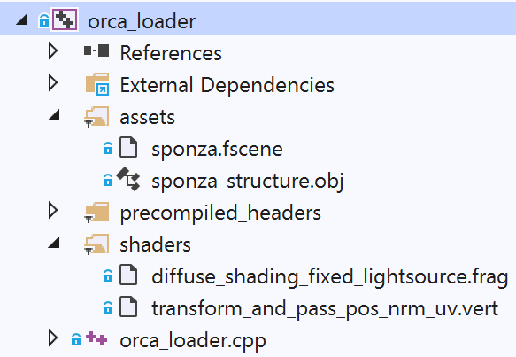
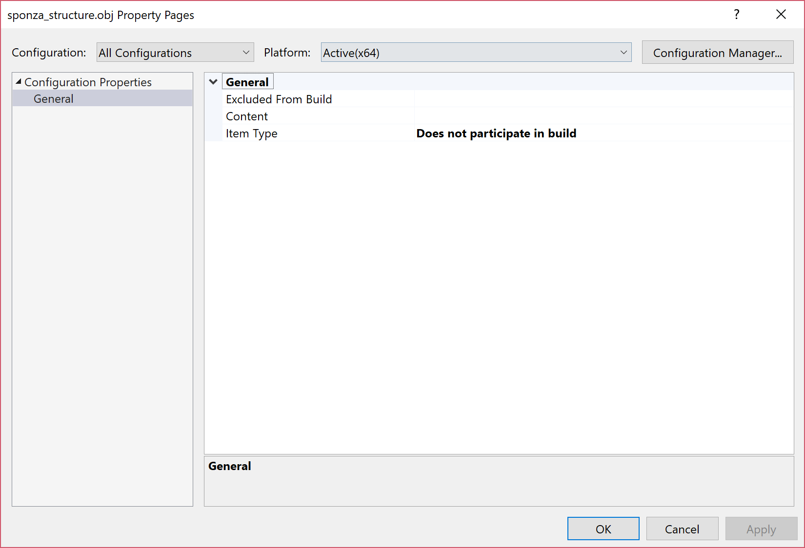
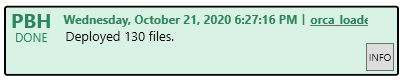
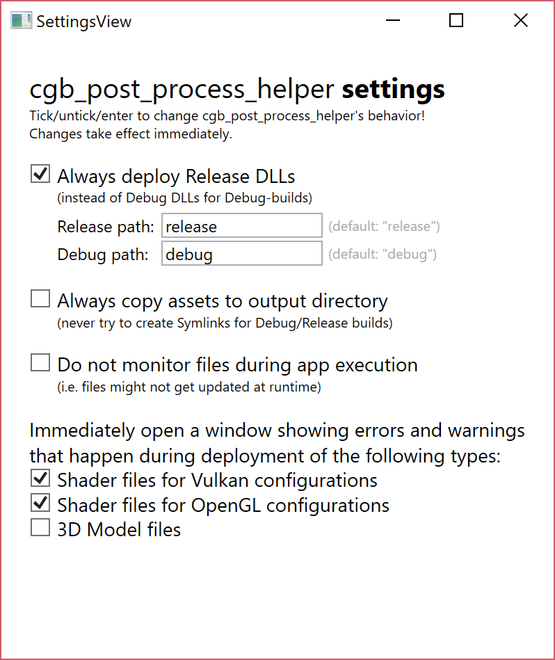

# Table of Contents

- [Setup](#setup)
- [Project Management with Visual Studio](#project-management-with-visual-studio)
  - [Creating a New Project](#creating-a-new-project)
  - [Resource Management](#resource-management)
    - [Dependent Assets](#dependent-assets)
    - [Known Issues and Troubleshooting w.r.t. Asset Handling](#known-issues-and-troubleshooting-wrt-asset-handling)
      - [Build errors when adding assets](#build-errors-when-adding-assets)
      - [Asset is not deployed because it is not saved in the Visual Studio's filters-file](#asset-is-not-deployed-because-it-is-not-saved-in-the-visual-studios-filters-file)
  - [Post Build Helper](#post-build-helper)
    - [Deployment of Dependent Assets](#deployment-of-dependent-assets)
    - [Symbolic Links/Copies depending on Build Configuration](#symbolic-linkscopies-depending-on-build-configuration)
    - [_Post Build Helper_ Troubleshooting](#post-build-helper-troubleshooting)
      - [Build is stuck at "Going to invoke[...]MSBuild.exe" step, displayed in Visual Studio's _Output_ tab](#build-is-stuck-at-going-to-invokemsbuildexe-step-displayed-in-visual-studios-output-tab)
      - [_Post Build Helper_ can't be built automatically/via MSBuild.exe](#post-build-helper-cant-be-built-automaticallyvia-msbuildexe)
      - [Too few resources are being deployed](#too-few-resources-are-being-deployed)
      - [Application could not start at first try (maybe due to missing assets or DLLs)](#application-could-not-start-at-first-try-maybe-due-to-missing-assets-or-dlls)
      - [Error message about denied access to DLL files (DLLs are not re-deployed)](#error-message-about-denied-access-to-dll-files-dlls-are-not-re-deployed)
      - [Slow performance when showing lists within the Post Build Helper](#slow-performance-when-showing-lists-within-the-post-build-helper)
      - [Error message in the UI of Post Build Helper: "Could not find part of the path '...'"](#error-message-in-the-ui-of-post-build-helper-could-not-find-part-of-the-path-)
      - [Error message in the console: `can't fopen`, or `!RUNTIME ERROR! Couldn't load image from '...'` or similar](#error-message-in-the-console-cant-fopen-or-runtime-error-couldnt-load-image-from--or-similar)
    - [_Post Build Helper_ Settings](#post-build-helper-settings)

# Setup

For fundamental installation instructions and basic setup, please refer to the main [README.md](../README.md)'s [Visual Studio 2022](../README.md#visual-studio-2022) section.

# Project Management with Visual Studio

The Visual Studio projects can be used for resource management and there is a _Post Build Helper_ tool which handles SPIR-V compilation of shader files and deployment of resource files to the target directory. Its located under [`visual_studio/tools/executables/`](./tools/executables) and is invoked as a build step of _Auto-Vk-Toolkit_'s example applications. 

The repository contains one solution file: [`auto_vk_toolkit.sln`](./) which references multiple Visual Studio project files (`*.vcxproj`): The _Auto-Vk-Toolkit_ library project and several example projects. Out of the box, they are configured for Visual Studio 2022 and are set to use C++ with the latest language features, i.e. `/std:c++latest`. 

The examples' Visual Studio project files are located in [`visual_studio/examples/`](./examples). Their source code is located in [`examples/`](../examples). All examples reference the _Auto-Vk-Toolkit_ library project ([`auto_vk_toolkit.vcxproj`](./auto_vk_toolkit/)). Substantial parts of the Visual Studio project configuration is handled via property files which are located under [`props/`](./props).

## Creating a New Project

In order to create a new project that uses the _Auto-Vk-Toolkit_ framework, you have to reference the framework and reference the correct property files, e.g. `rendering_api_vulkan.props` for Vulkan-specific dependencies, or `linked_libs_debug.props` for Debug builds. The example configurations are fully configured.

A more convenient way to create a new project could be to use the `create_new_project.exe` tool, located under [`visual_studio/tools/executables/`](./tools/executables). It allows to copy the settings from an existing project (e.g., one of the examples) and effectively duplicates and renames a selected project. Step by step instructions can be found in the root directory's [`README.md`](../README.md) file under the section [Creating a New Project](../README.md#creating-a-new-project).

## Resource Management

Most applications created with _Auto-Vk-Toolkit_ will probably require additional resources like shader files, images, or 3D models. _Auto-Vk-Toolkit_ offers an elegant way to manage these resources through Visual Studio's filters and its _Post Build Helper_.

To manage project's asset and shader dependencies, they can simply be added to Visual Studio's filters, which are just Visual Studio's standard way of managing project file references. The data is stored in `*.vcxproj.filters` files. _Auto-Vk-Toolkit_ -- more precisely, its _Post Build Helper_ -- analyzes these `*.vcxproj.filters` files and assigns special meaning to two filter names: 

* `assets`, and
* `shaders`.

The following figure shows an example of a project configuration where shaders, a 3D model file, and an [ORCA](https://developer.nvidia.com/orca) scene file are linked under these two special filters: 



When building the project, all these resources get deployed **according to their filter-path** to the target directory. That means, the 3D model `sponza_structure.obj` will be deployed to `$(TargetDir)/assets/sponza_structure.obj`, regardless of where the source `sponza_structure.obj` file is located. Sub-folders in filter paths are preserved. I.e. the filter-path as configure within Visual Studio's filters, is the path where the application can expect resources to be loadable from.

The `sponza_structure.obj` model from the example can be loaded like follows:
```
auto sponza = avk::model_t::load_from_file("assets/sponza_structure.obj", aiProcess_Triangulate | aiProcess_PreTransformVertices);
```

Load ORCA scene file `sponza.fscene` from the example can be loaded like follows:
```
auto orca = avk::orca_scene_t::load_from_file("assets/sponza.fscene");
```

Shader files are automatically compiled to SPIR-V by the _Post Build Helper_ and they get a `.spv` extension when deployed to the target directory. Aside from the additional extension, their path stays the same. I.e. the `transform_and_pass_pos_nrm_uv.vert` shader from the example can be loaded from `shaders/transform_and_pass_pos_nrm_uv.vert.spv`. To emphasize it again: This target location is completely unattached from the `transform_and_pass_pos_nrm_uv.vert` shader file's source location on the file system. Only the filter path determines where it will be deployed to.

The shader files from the example can be used for creating a graphics pipeline like follows (note that the added `.spv` extension can be left out. It's automatically added by _Auto-Vk-Toolkit_ when loading a shader from a given path fails at the first try.):
```
auto pipeline = avk::context().create_graphics_pipeline_for(
	avk::vertex_shader("shaders/transform_and_pass_pos_nrm_uv.vert"),
	avk::fragment_shader("shaders/diffuse_shading_fixed_lightsource.frag"),
	avk::cfg::front_face::define_front_faces_to_be_counter_clockwise(),
	avk::from_buffer_binding(0) -> stream_per_vertex<glm::vec3>() -> to_location(0),
	avk::from_buffer_binding(1) -> stream_per_vertex<glm::vec2>() -> to_location(1),
	avk::from_buffer_binding(2) -> stream_per_vertex<glm::vec3>() -> to_location(2)
);
```

### Dependent Assets

Some assets have dependent assets. This mostly applies to 3D models which reference textures. All the dependent assets are deployed to the target directory as well. You don't need to add them manually to the filters file, but you have to make sure that the asset paths in the "root asset" **point to valid paths to the dependent assets**. Also, make sure that dependent assets are **in the same folder or in a subfolder** w.r.t. to the root asset. If they aren't, it might be impossible to deploy them properly, because they have to remain in the same relative directory to the root assets (this might create a mess on your file system if the dependent assets weren't be in the same or in a sub-directory of the root asset).

**Example:**     

You add a `model.obj` file directly to your `assets` filter in your Visual Studio project. Let's assume that the `model.obj` file has an associated `model.mat` file, containing the materials, and let's further assume that the `.mat` file references the textures `texture01.jpg` and `normal_maps/texture02.png`. The following files will be deployed to the target directory:

* `assets/model.obj`
* `assets/model.mat`
* `assets/texture01.jpg`
* `assets/normal_maps/texture02.png`

**Dependent assets not present/not at the right path:**

If the _Post Build Helper_ notices that a dependent asset is not present or located at a path which is not a the same path or a sub-path w.r.t. the root asset, it will issue a warning. You might still be able to compile a working project configuration by assigning all your dependent asset to the right filters in Visual Studio and just ignore the _Post Build Helper_'s warnings. 

For the example above, you'd have to create the following filters structure in your Visual Studio project in order to manually set-up the deployment of all required files:

* `assets/`
  * `model.obj`
  * `model.mat`
  * `texture01.jpg`
  * `normal_maps/`
    * `texture02.png`

### Known Issues and Troubleshooting w.r.t. Asset Handling

#### Build errors when adding assets

In many cases, assets can just be dragged into the appropriate filters in Visual Studio, but for some file types, Visual Studio assumes that it should build them. This happens, among others, for 3D models in OBJ-format. To prevent that special Visual Studio treatment for such files, please set the assets' **Item Type** to `"Does not participate in build"` which can be done from the file's properties in Visual Studio (select file -> right click -> select _Properties_ -> navigate to the tab `"General"` -> set the `"Item Type"` to `"Does not participate in build"`). Here is a screenshot of the property pages with the appropriate setting:



#### Asset is not deployed because it is not saved in the Visual Studio's filters-file

Sometimes, Visual Studio won't store the exact filter path immediately in the `*.vcxproj.filters` file, which results in the affected file not being deployed to the target directory. In order to ensure that a file reference has definitely been stored in the `*.vcxproj.filters` file, please try the following steps:

1. Execute `Save All` from Visual Studio's `File` menu.
2. Close and re-open Visual Studio 
3. Ensure that the `*.vcxproj.filters` file contains the correct value, which should look something like follows:

```
    <None Include="..\..\..\assets\3rd_party\models\sponza\sponza_structure.obj">
      <Filter>assets</Filter>
    </None>
```

Make sure that the `<Filter>` element is present and set to the correct value. In this case, the element's name is `<None>` because the file has been configured to `"Does not participate in build"`.

## Post Build Helper 

The _Post Build Helper_ is a helper tool which is invoked upon successful building of a project. It deploys all the referenced assets (i.e. everything assigned to `shaders` or `assets` filters in Visual Studio) to the target directory, which includes the SPIR-V compilation of shader files. It also deploys all the dependent assets, like, for example, all the textures which are referenced by a 3D model file.

The _Post Build Helper_ will provide a tray icon, informing about the deployment process and providing lists of deployed files and it will **stay active as a tray application** until you close it. The tray icon provides several actions that can be accessed by left-clicking or right-clicking it. It does not only stay active for providing information, but -- most importantly if you'd like to use _Auto-Vk-Toolkit_'s Shader Hot Reloading feature -- for monitoring the deployed files for changes, and re-deploying these files if changes have been detected. (This means that you can modify, e.g., a shader file that you have added to your Visual Studio project; and by saving it, the _Post Build Helper_ will recognize the change and re-deploy the shader file to the target directory, where it can be loaded from during application run-time in order to hot-reload it and update the pipelines where it is in use.)     
The _Post Build Helper_'s tray icon looks like this: .

### Deployment of Dependent Assets

As detailed above, under section [Dependent Assets](#dependent-assets), the _Post Build Helper_ also deploys all dependent assets that are referenced by a certain asset.

When building the [`orca_loader` example](./examples/orca_loader), you should see 130 assets being deployed to the target directory, although only four files (two under filter `assets`, and two under filter `shaders`) are referenced in the Visual Studio project. The sponza 3D model references many textures, all of which are deployed to the target directory as well. Models referenced in [ORCA](https://developer.nvidia.com/orca) `.fscene` files are dependent assets of these `.fscene` files, and each referenced model can have dependent assets as well. All these dependencies are resolved recursively and deployed to the target directory. In addition to that, `.dll` files of [external dependencies](../external) are deployed to the target directory.



If the `orca_loader` example does not deploy 130 assets, please check section [Too few resources are being deployed](#too-few-resources-are-being-deployed) below.

### Symbolic Links/Copies depending on Build Configuration

The Visual Studio projects support different build configuration. Besides "Debug" and "Release" configurations, there's also a "Publish" configuration. The exact names of the configurations are as follows:
* `Debug_Vulkan` => a _Debug_ configuration
* `Release_Vulkan` => a _Release_ configuration
* `Publish_Vulkan` => a _Release_ configuration with additional properties

Depending on the configuration, _Post Build Helper_ can be configured to deploy resources by creating symbolic links in the target directories, or instead copying the resources into the target directories. Symbolic links can be created faster than copying files, which can be especially noticeable for large or many files. While _Release_ and _Publish_ builds have the same compilation configuration, _Post Build Helper_ differentiates between these two insofar as _Publish_ builds will **always** have the resources **copied** into the target directory, whereas _Debug_ and _Release_ builds will have symbolic links created for its resources and dependent assets.

Shader files are an exception to this. Shader files have to be SPIR-V compiled before they can be used. The SPIR-V files are created directly in the target directories, always.

The deployment behavior for _Debug_ and _Release_ builds can be configured via _Post Build Helper_'s [settings](#post-build-helper-settings). The option "Always copy assets to output directories" forces copies being made also for _Debug_ and _Release_ builds. _Publish_ builds are not affected from it and will always have the resources being copied --- never symlinked.

### _Post Build Helper_ Troubleshooting

#### Build is stuck at "Going to invoke[...]MSBuild.exe" step, displayed in Visual Studio's _Output_ tab

Upon _Post Build Helper_'s first usage, it is being built directly on your PC via `MSBuild.exe`. This solves some compatibility issues and ensures optimal mode of operation. However, sometimes the `MSBuild.exe`-step can get stuck (for unknown reasons). In order to solve it, it usually suffices to stop the build (Build -> Cancel) and build again. 

#### _Post Build Helper_ can't be built automatically/via MSBuild.exe

The _Post Build Helper_ has been successfully built on your PC if there is an `cgb_post_build_helper.exe` file under [`visual_studio/tools/executables/`](./tools/executables/). It should be built automatically during a Visual Studio post build step, which is invoked through, e.g., building one of the example applications. 

If it can't be built automatically, please build it automatically. It is a Visual Studio C# project, i.e. please ensure to have .NET/C# workloads installed with your Visual Studio (you can install these via the Visual Studio Installer).

Follow these steps to build the _Post Build Helper_ manually:

1. Open the `cgb_post_build_helper.sln` Visual Studio solution, which can be found under [`visual_studio/tools/sources/post_build_helper/`](./tools/sources/post_build_helper)
2. Select the `Release` build and build the project.
3. A custom build event will automatically copy `cgb_post_build_helper.exe` into [`visual_studio/tools/executables/`](./tools/executables), which is the location that is used for executing the _Post Build Helper_ as a post build step from the Visual Studio projects.
	
If you still experience problems after following these steps, please create an [Issue](https://github.com/cg-tuwien/Auto-Vk-Toolkit/issues) and describe your situation in detail.

#### Too few resources are being deployed

With older versions of the _Post Build Helper_ there used to be a problem where too few resources were deployed. In the `orca_loader` example from above, 130 files should be deployed. If fewer files are deployed, you might still be subject to this problem. Please try to build the _Post Build Helper_ by yourself and see if it solves the problem.

#### Application could not start at first try (maybe due to missing assets or DLLs)

The _Post Build Helper_ runs asynchronously to not block Visual Studio. Although the custom build step waits up to 10 seconds for the _Post Build Helper_ to finish its deployment work, it stops to wait after 10 seconds and continues running the application. In situations where the deployment takes very long, this can have the effect that deployment may still be in progress when the application is already starting. 

One strategy to solve it might be to build (not build and run) the project and wait until the Post Build Helper's tray icon shows no more animated dots, before starting your application!

#### Error message about denied access to DLL files (DLLs are not re-deployed)

"Access denied" error messages w.r.t. DLL files are usually not a problem. Some process still accesses the `.dll` files in the target directory and prevents the _Post Build Helper_ to replace them. However, in most cases the files would just be exactly the same `.dll` files as in the previous build (except you've updated them). If it turns out to be a real issue, please submit an [Issue](https://github.com/cg-tuwien/Auto-Vk-Toolkit/issues) and as a first-aid measure, try to kill all processes which might access the affected DLL files (closing console windows, closing Windows Explorer, exiting the _Post Build Helper_).

#### Slow performance when showing lists within the Post Build Helper

When _Post Build Helper_'s UI takes a long time to load, it might be that its internal lists have become very big in size. Restart the _Post Build Helper_ to clear the internal lists by right-clicking on the tray icon, and selecting `Exit`. A new instance of the _Post Build Helper_ will be created at the next build with fresh, but empty lists.

_Beware:_ All the existing lists will be gone after closing the _Post Build Helper_. No event data is persistently stored.

#### Error message in the UI of Post Build Helper: "Could not find part of the path '...'"

You might be subject to a the 260 character-path length limit of Windows. Try disabling the maximum file path length of 260 characters, or alternatively move the project to a location with a shorter path!

#### Error message in the console: `can't fopen`, or `!RUNTIME ERROR! Couldn't load image from '...'` or similar

Sometimes, symlinks cause such problems. The _Post Build Helper_ deploys files as symlinks by default instead of copying the files. For unknown reasons, _Auto-Vk-Toolkit_ applications sometimes fail to open such symlinked files. If you encounter this problem, please try enabling _Post Build Helper_'s **"Always copy assets to output directly"** setting. This setting can be seen below in the screenshot under [_Post Build Helper_ Settings](#post-build-helper-settings). 

### _Post Build Helper_ Settings

The _Post Build Helper_ has several settings that might be helpful during the development process. They can be accessed by right-clicking on the tray icon and executing `Open Settings`.



The setting "Always deploy release DLLs" can lead to significantly increased performance when loading textures or 3D models from Debug builds.

The settings which open popup windows if shader errors are detected can be helpful during shader development.
	
	
